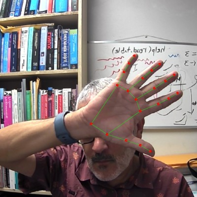

```js
import renderP5Sketch from "./p5-sketch.js"
```

```js 
function getCanvas() {
  const div = html`<div style="width: 100%; height: 400px; border-radius: 16px; overflow: hidden;"></div>`;

  function startWhenReady() {
    requestAnimationFrame(() => {
      const w = div.clientWidth;
      const h = div.clientHeight;

      // Si aún no tiene tamaño visible, vuelve a intentar
      if (w === 0 || h === 0) {
        setTimeout(startWhenReady, 100);
      } else {
        renderP5Sketch(div, w, h);
      }
    });
  }

  startWhenReady();
  return div;
}

```


<div class="grid grid-cols-2">
  <div class="card" style="border: none; display: flex; flex-direction: column; justify-content: center; align-items: center; text-align: center;">
  <h1>Elio Ramos Colón</h1> <br> 
  <h2>Departamento de Matemática <br>
  Universidad de Puerto Rico en Humacao</h2> 
  </div>
  <div class="card" style="border: none;">
  
  </div>
</div> 


<div class="grid grid-cols-2">
  <div class="card" style="border: none;">
    
  </div>
  <div class="card" style="border: none;">
    
    <br>
    <p style="margin-top: 0.5rem; text-align: center;">
      "Caleidoscopio 3" (2020) – desarrollado en <a href="https://p5js.org/" target="_blank">p5js</a> <br>
      <a href="https://openprocessing.org/sketch/951702" target="_blank">Ver Código</a>
    </p>
  </div>
</div>


<div style="max-width:95%; margin-left: 0; margin-right: auto; text-align: justify;">
  Soy profesor de Matemáticas, Ciencia de Cómputo y Ciencia de Datos en el Departamento de Matemáticas de la <a href="https://www.uprh.edu" target="_blank">Universidad de Puerto Rico en Humacao</a>.  Soy el coordinador académico del <a href="https://cdat.uprh.edu" target="_blank">Programa de Bachillerato en Ciencia de Datos (PBCD)</a>.Tengo un PhD en Ciencias Computacionales e Informática de <a href="https://gmu.edu" target="_blank">George Mason University</a>.  
  
  Dentro del PBCD enseño los cursos de:

<ul>
<li>Introducción a la Programación y la Ciencia de Cómputos I y su Laboratorio (Comp3081/Comp3083)</li>
<li>Introducción a la Programación y la Ciencia de Cómputos II y su Laboratorio (Comp3082/Comp3084)</li>
<li>Visualización de Datos (CDAT3001)</li>
<li>Diseño de Aplicaciones para la Web y Móviles (Comp4010)</li>
<li>Investigación subgraduada (Mate4010)</li>
</ul>

</div>

<div style="max-width:95%; margin-left: 0; margin-right: auto; text-align: justify;">
Además, enseño cursos introductorios de programación que son parte de la <a href="https://cdat.uprh.edu/concentracion-menor.html" target="_blank">Concentración Menor en Ciencia de Datos</a>: 
</div>

<ul>
<li>Introducción al uso de la Computadora (Comp3005)</li>
<li>Introducción a la Programación y el Análisis Numérico (Mate3009)</li>
<li>Programación de Computadoras y Algoritmos (Inge3016) </li>
</ul>


<p>Puedes ver algunos de mis proyectos en <a href="https://github.com/elioramosweb" target="_blank">mi perfil de GitHub</a>.</p>


<b>Correo-electrónico</b>: elio.ramos@upr.edu<br>


<style>

body {
  font-family: 'Roboto', 'Inter', 'Lato', sans-serif; /* fallback entre sans-serif modernos */
  background-color: #f9fafb; /* fondo claro, sobrio */
  color: #111827;            /* texto casi negro para buen contraste */
  line-height: 1.7;          /* legibilidad */
  letter-spacing: 0.01em;    /* espaciado sutil */
  padding: 1.5rem;           /* espacios amplios alrededor del contenido */
  /* max-width: 80%;           /* evita líneas muy largas */
  margin: auto; */
} 


.hero {
  display: flex;
  flex-direction: column;
  align-items: center;
  font-family: var(--sans-serif);
  margin: 4rem 0 8rem;
  text-wrap: balance;
  text-align: center;
}

.hero h1 {
  margin: 1rem 0;
  padding: 1rem 0;
  max-width: none;
  font-size: 14vw;
  font-weight: 900;
  line-height: 1;
  background: linear-gradient(30deg, var(--theme-foreground-focus), currentColor);
  -webkit-background-clip: text;
  -webkit-text-fill-color: transparent;
  background-clip: text;
}

.hero h2 {
  margin: 0;
  max-width: 34em;
  font-size: 20px;
  font-style: initial;
  font-weight: 500;
  line-height: 1.5;
  color: var(--theme-foreground-muted);
}

article, .post-content {
  max-width: 42rem;    /* ajusta a tu gusto */
  margin-left: auto;   /* centra */
  margin-right: auto;
}

@media (min-width: 640px) {
  .hero h1 {
    font-size: 90px;
  }
}

</style>
